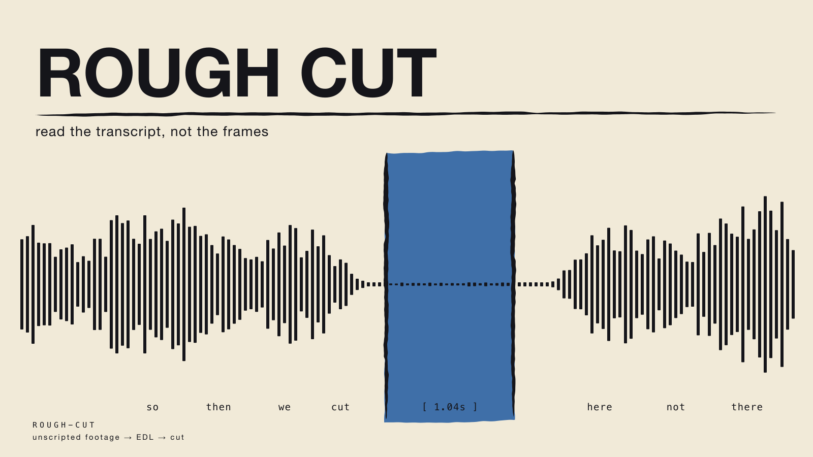

# whetstone · 磨刀石

[](README.md)
[](README.zh.md)
[](LICENSE)

**中文** · [English version here / 英文说明点这里](README.md)

**磨刀石自己不切东西，它让刀能切。**

给 [Claude Code](https://claude.com/claude-code) 用的九件 skill，从一套日常在跑的 skill
库里挑出来、洗干净坐标之后放出来的。每一件对着的都是**一类活**，不是一种偏好：陌生人拿
自己的材料就能照着跑，坑写在明处，代价说清楚。

> **只适配 Claude Code。** 用的是 Claude Code 的 skill 格式与加载机制，也只在它上面测过。
> 你要是用别的 agent，欢迎拿去——但**适配那一步归你自己做**，本仓不声称支持，也不提供支持。

> **授权一句话**：可以自由使用、修改、传播，但必须**署名**、**以相同方式共享**，且
> **禁止任何商业用途**。细则见 [授权](#授权)。



## 怎么装

```bash
git clone https://github.com/j912835225-prog/whetstone.git
cp -r whetstone/rough-cut ~/.claude/skills/      # 只要一件
cp -r whetstone/*/ ~/.claude/skills/             # 九件全要
```

放 `~/.claude/skills/` 是全局可用；放某个项目里的 `.claude/skills/` 只在那个项目生效。
这两个路径都是 Claude Code 的。
每个文件夹自成一体，彼此不引用，可以只拿你要的那一件。装完开一个新会话，直接说你要干的
那类活就行——描述对得上，它自己会加载。

## 九件是什么

| Skill | 干什么用 | 正文语言 |
|---|---|---|
| [**rough-cut**](rough-cut/) | 没有剧本的素材怎么剪：访谈、播客、录屏、多条口播 take。核心是让模型读词级转写，不是看三万帧——切点在声音里，不在画面里。带七个能跑的脚本和自检 | 英文 |
| [**audit-anything**](audit-anything/) | 审一件东西、一个动作、或一条论证链，最后要出**判断**，不是出一张清单。证据等级、三支审法、判词四档、审者自审 | 英文 |
| [**visual-contract**](visual-contract/) | 动手改设计之前先写下「这张参考图我借什么、不借什么」，免得一张截图或者一句「做现代点」把既定的视觉语言悄悄换掉。带 AI 味避免清单和反偏移七问 | 英文 |
| [**tame-sprawl**](tame-sprawl/) | 一堆文档／skill／提示词／配置乱了要整顿：四步不许跳，验收不看「从 47 个减到 12 个」 | 英文 |
| [**code-print**](code-print/) | 用代码画印刷件，不用生图：海报、封面、zine、票券、标签。矢量、可导 PDF、字一个不会歪、同样输入出同样的文件。带两个绘图引擎、一件完整实作、自检 | 英文 |
| [**unknown-first**](unknown-first/) | 一条常设义务：每轮都要递给人他不知道的东西；配一张已知／未知地图，和两份能被下一个模型实例读的沉淀。带检查脚本 | 英文 |
| [**chinese-prose**](chinese-prose/) | 中文成稿检查表：场合与语气档、大纲三问、删改判据、用字四查、交前五挑错、评稿六看 | 中文 |
| [**script-check**](script-check/) | 剧本与叙事的结构与对白检查表：一人一事、伏笔成对、对白八查、三处收口、旧本翻新 | 中文 |
| [**classical-chinese-translation**](classical-chinese-translation/) | 古籍整本译白话的工序与防漂移闸：底本纪律、回目交叉核、四条漂移触发点、pandoc 出书、收工三验 | 中文 |

**为什么有的是英文有的是中文**：这是判断，不是偷懒。三件中文的编码的就是中文写作与翻译
的工艺，译成英文本体就没了；另外六件对任何语言的材料都成立，所以走英文。英文那六件的
中文说明就在这张表里，看不懂正文也知道它是干嘛的、值不值得装。

## 这九件的共同点

- **触发的是一类活**，不是「要认真」这种随时成立的废话。
- **写坑不写道理**。每条规矩都说清楚它当初是怎么换来的，且能拿你自己的材料去验。
- **做不到的明说**。rough-cut 不会分说话人，audit-anything 不判审美——写在正文里，不含糊。
- **不联网、不留后门**。没有 API key、没有账号、没有任何指向别人机器的路径。

## 带代码的三件怎么验

```bash
python3 rough-cut/scripts/selftest.py          # 21 项断言，自己造样片
python3 code-print/scripts/selftest.py         # 22 项断言，自己画一张测试稿
python3 unknown-first/scripts/check.py --help  # 按规格检查沉淀文件
```

macOS 上实测过：本机解释器和一个全空的 `python -m venv` 都跑通。Linux 与 Windows 没测，
欢迎报。rough-cut 需要 `ffmpeg`；它的转写那一步需要 `openai-whisper`，这是唯一要你手动
装的依赖——因为它会拖 PyTorch 进来，这个决定该由你自己做。

## 配图

九件各配一张横版海报，在 [posters/](posters/) 里，可以直接当 README 头图或者社交平台配图。
它们不是生图出来的，是 `code-print` 自己的引擎画的——就是那件 skill 里的 `woodcut.py`
和 `printlab.py`。每个 build 脚本的 docstring 里写着它自己的配方。

```bash
cd posters && python3 build_rough_cut.py && rsvg-convert -w 1600 -h 900 rough-cut.svg -o png/rough-cut.png
```

## 授权

**[CC BY-NC-SA 4.0](LICENSE)**（署名 — 非商业性使用 — 相同方式共享）。

**可以**：自己用、改、传给别人。
**必须**：注明出处；传出去的版本用同样的授权。
**不可以**：**任何商业用途**——不许卖、不许打包进收费产品或收费服务、不许作为商业服务的
一部分提供。

拿不准算不算商业用途，先问再上线。因为排除了商业使用，它严格说是 *source-available*
（源码可得），不是 OSI 定义下的开源——这是有意的选择，写明白，不拿一个眼熟的徽章糊过去。

**第三方出处**：rough-cut 的「转写优先」思路参考了开源项目
[video-use](https://github.com/browser-use/video-use)，实现是独立重写的；code-print 的
「先解配方再落笔」「每块版必须有职责」「一个焦点一片留白」三条取自
[mono-color-skill](https://github.com/yanliudesign/mono-color-skill) 并重写；
unknown-first 接的是 Korzybski 的「地图非疆域」，并把 Thariq Shihipar
*A Field Guide to Fable: Finding Your Unknowns*（Anthropic，2026）的方向反转过来用；三件中文的取自古代文论（刘勰、
李渔），code-print 的审那一节取傅山「四毋」——都早已进入公有领域。本仓不转载任何第三方的
示例图、字体或数据集。

## 参与

哪条规矩在你的真实材料上让你付了代价，就改掉它，并写清楚为什么。经不起别人材料检验的规矩，
不配留在一件共享的 skill 里。欢迎提 issue 和 PR；提交即表示你的贡献同样以本授权发布。
